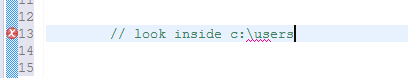

## 采用的字符集

Unicode: "采用双字节对字符进行编码；统一的字符编码标准"

例如:\n的Unicode值:\u000a

**注意事项:**
注释中的\u:

	因为Unicode值别替换为实际字符,所以下列注释:
	// \u000a is a new line
	将成为:

	// 
	is a new Line
	此时将出现语法错误

效果如下:

因此,应注意windows下的路径:
// look inside c:\users

因为,\u后面没有跟上十六进制数值

